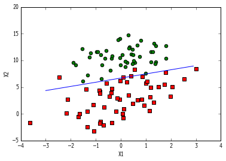

逻辑回归(Logistic regression)
===

[逻辑回归](http://52opencourse.com/125/coursera%E5%85%AC%E5%BC%80%E8%AF%BE%E7%AC%94%E8%AE%B0-%E6%96%AF%E5%9D%A6%E7%A6%8F%E5%A4%A7%E5%AD%A6%E6%9C%BA%E5%99%A8%E5%AD%A6%E4%B9%A0%E7%AC%AC%E5%85%AD%E8%AF%BE-%E9%80%BB%E8%BE%91%E5%9B%9E%E5%BD%92-logistic-regression)的主要思想是：根据现有数据对分类边界线建立回归公式，以此进行分类。

此处，目标函数采用对数似然函数，优化算法采用[梯度上升算法](http://www.cnblogs.com/hitwhhw09/p/4715030.html)

> 当然如果你的目标函数也可以采用[交叉熵](http://blog.csdn.net/u012162613/article/details/44239919)，那么优化算法就可采用梯度下降算法。


    [[ 4.12414349]
     [ 0.48007329]
     [-0.6168482 ]]





梯度上升算法每次更新回归系数需要遍历整个数据集，在小数据上更新尚可，但是如果是大数据上呢。改进方法是一次仅用一个样本更新回归系数，称为**随机梯度上升算法**。

> 由于可以在新样本来到时对分类器进行增量更新，因此随机梯度上升算法是一个在线学习算法。与“在线学习”相对应，一次处理所有数据被称为“批处理”。

```
随机梯度上升算法伪代码：

所有回归系数初始化为1
对数据集中每个样本
	计算该样本的梯度
	使用alpha×gradient更新回归系数值
返回回归系数值
```

